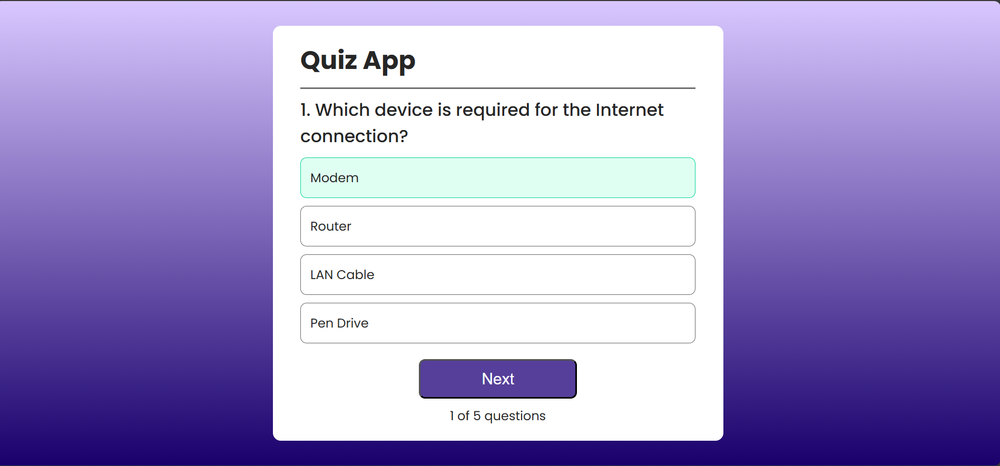
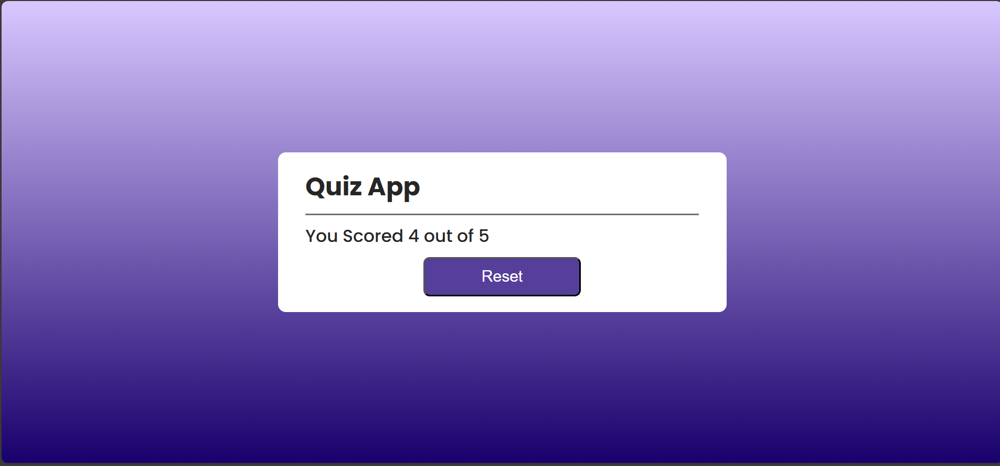

🧠 Quiz App – React

A simple and interactive Quiz Application built using React.js.
This project was created to practice React concepts like hooks, state management, conditional rendering, and DOM manipulation using useRef.

🚀 Features

📌 Multiple choice questions
✅ Highlights correct answer
❌ Shows wrong answer selection
🔒 Prevents multiple selections (lock system)
🔄 Next question functionality
📊 Dynamic question counter
🎨 Clean and responsive UI 

🛠️ Built With

React.js
JavaScript (ES6+)
CSS3
Vite (for project setup) 
Vercel for deploying 

## 📸 Screenshots

### Correct Answer

### Wrong Answer

### Result Screen
 
 
📌 Author
Sakshi Kirola